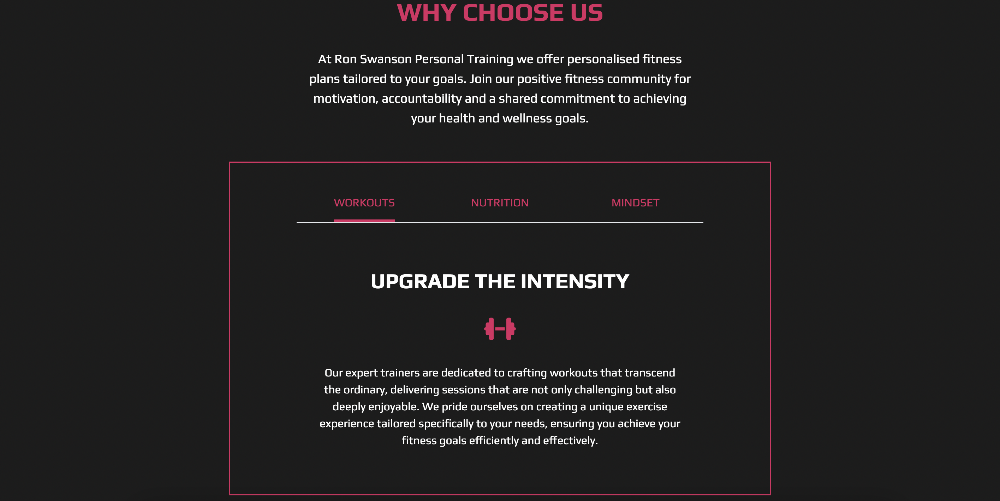
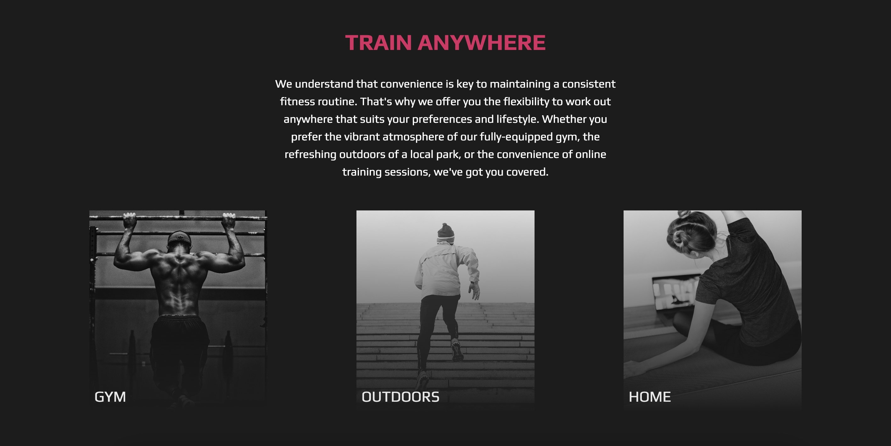
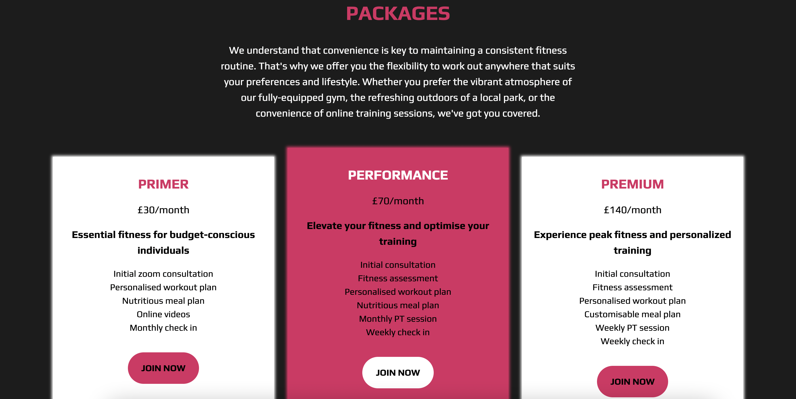
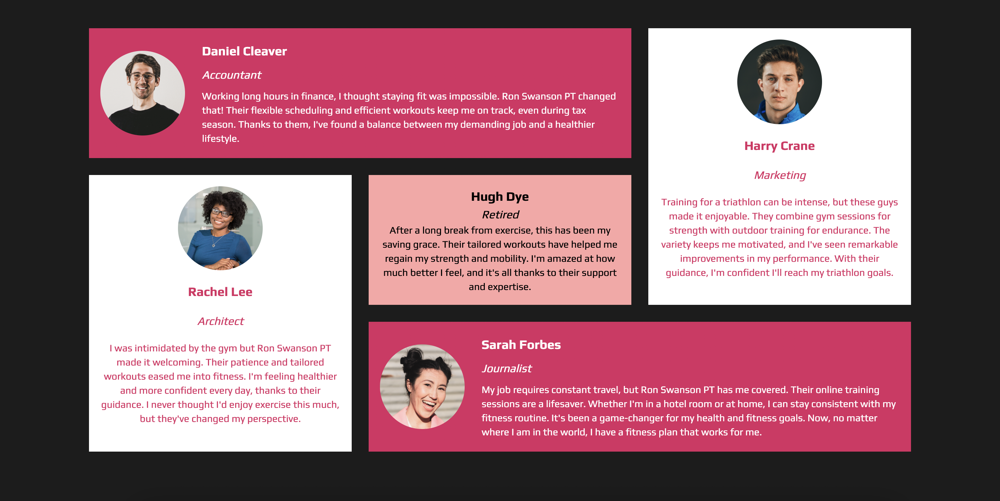
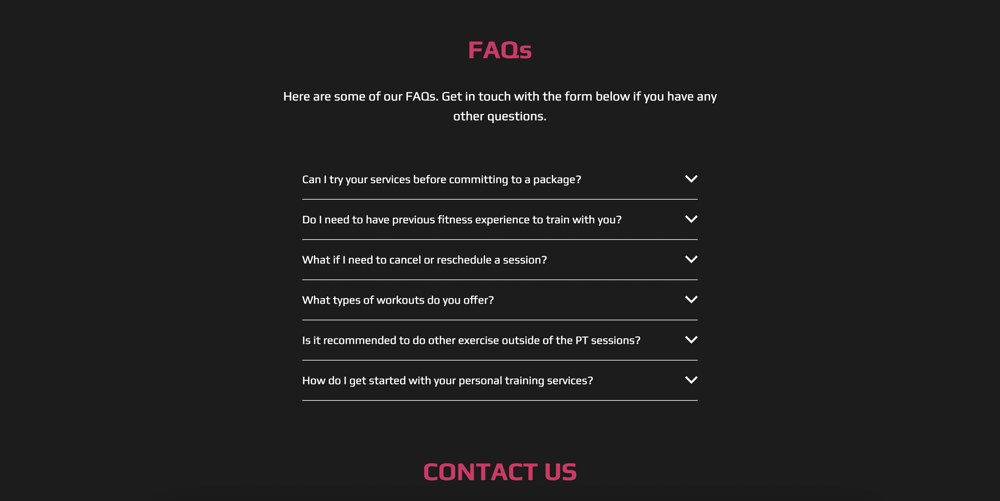
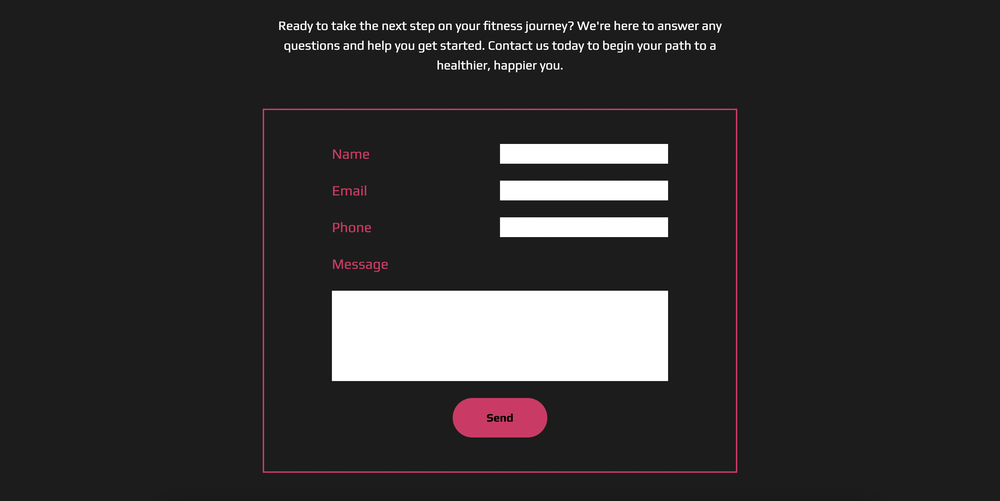

## RON SWANSON PERSONAL TRAINING ##

Tailwind designed landing page for personal trainer's business page. 

:round_pushpin: [wwww.ronswansonpt.com](https://creative-dasik-19f68c.netlify.app)

<section>
   
</section>

 
 

<section align=center>
 
 
 
 
 
 
 
</section>
